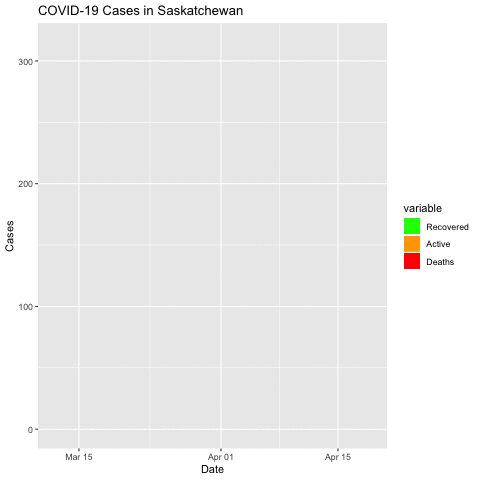

# COVID-19 in Saskatchewan

A repository for tracking COVID-19 stats for Saskatchewan. Non-government affiliated. Crowd sourced.

## UPDATE NOTES

As of May 15, 2020, there is a new format for COVID-19 data by the SK government. Daily files created for SK cases and testing are no longer available. Instead, there is additional data available in CSV & JSON files.

## The data

###  Collection

On March 16, 2020 I began putting COVID-19 number from Saskatchewan into a spreadsheet and I updated it every day after the numbers were released in the afternoon (See Notes and links below). The file [cases-sk.csv](https://github.com/SaskOpenData/covid19-sask/blob/master/data/cases-sk.csv) is that spreadsheet that I've continued to update every day since, augmented by some data for the period March 12-15, 2020 that I compiled from the Excel charts that the SK Government posts on its website and a handful of posts on the r/saskatchewan subreddit. This period may not be accurate.

On March 22, 2020 I wrote a webscraper that collects the same data in a more detailed fashion in this repository. I run the scraper daily and output the datasets generated into the [/data](https://github.com/SaskOpenData/covid19-sask/tree/master/data) directory of this repository. There are 4 types of datestamped datasets in this directory:

- covid_sk_yyyymmdd.csv: The main table tracked with confirmed cases broken out regionally.
- covid_sk_age_dist_yyyymmdd.csv: A table showing the age distribution of confirmed cases in SK.
- covid_sk_testing_yyyymmdd.csv: A table of COVID-19 testing broken out regionally.
- lst_yyyymmdd.json: This is the list of bullet points at the top of the [government update page](https://www.saskatchewan.ca/government/health-care-administration-and-provider-resources/treatment-procedures-and-guidelines/emerging-public-health-issues/2019-novel-coronavirus/cases-and-risk-of-covid-19-in-saskatchewan). Sometimes  they put important info in here, but I haven't been using it for anything. Might be useful at some point down the line.

## Predictive stats

### Background 

I'm not an expert in epidemiology ... by a long shot. All predictive analysis is largely based on the forecast work done by [Ben Phillips](https://github.com/benflips/nCovForecast). 

There is some additional info in the [/forecast/](https://github.com/SaskOpenData/covid19-sask/tree/master/forecast) directory.

# Notes and links

## General Government info

https://www.saskatchewan.ca/government/health-care-administration-and-provider-resources/treatment-procedures-and-guidelines/emerging-public-health-issues/2019-novel-coronavirus

## Cases and risk

https://www.saskatchewan.ca/government/health-care-administration-and-provider-resources/treatment-procedures-and-guidelines/emerging-public-health-issues/2019-novel-coronavirus/cases-and-risk-of-covid-19-in-saskatchewan

## Public health orders

https://www.saskatchewan.ca/government/health-care-administration-and-provider-resources/treatment-procedures-and-guidelines/emerging-public-health-issues/2019-novel-coronavirus/public-health-measures/public-health-orders

## News releases

https://www.saskatchewan.ca/government/health-care-administration-and-provider-resources/treatment-procedures-and-guidelines/emerging-public-health-issues/2019-novel-coronavirus/latest-updates

